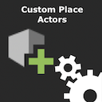
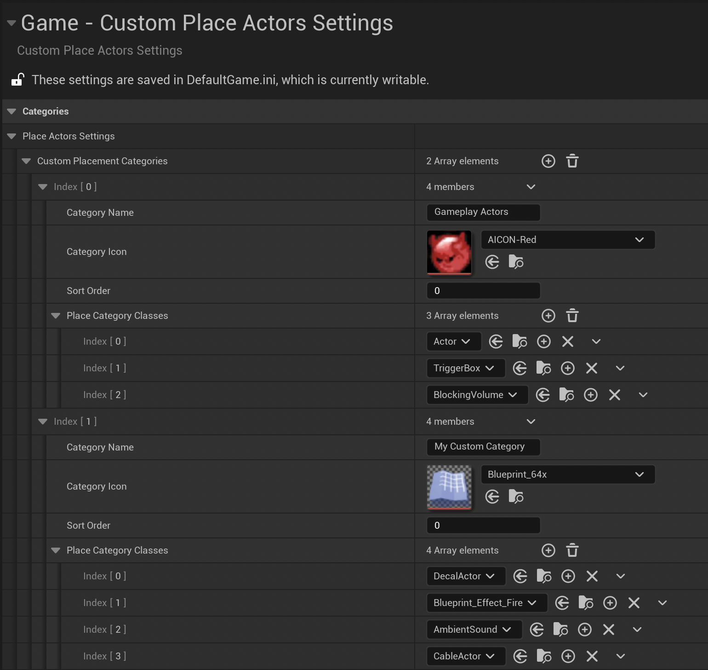
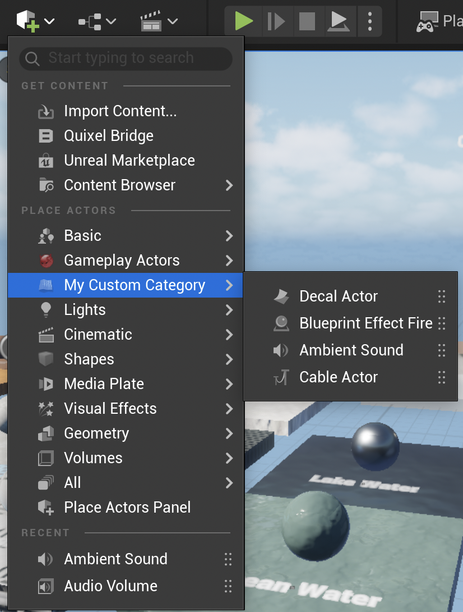
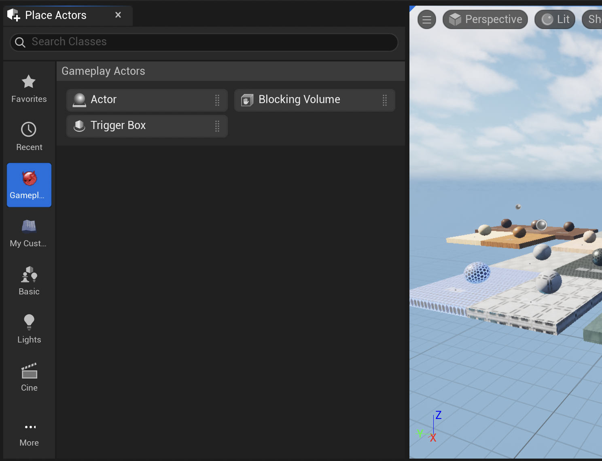

 

  
  <h3 align="center" style="font-size:6vw; font-weight: bold;">Custom Place Actors Plugin
  </h3>

  

    By: <a href="https://www.linkedin.com/in/levispev/">Levi Spevakow</a>
     
     
  

## About the project
This Unreal Engine plugin extends the engine by adding simple user interface for adding custom user-defined categories under the "Place Actors" panel / menu.

## Key Features
- Create any number of custom categories
- Populate categories with any number of actors
- Define an optional sorting order for a category
- Set an optional custom icon for a category
- Data is stored by default in the games config file for easy parity across source control

